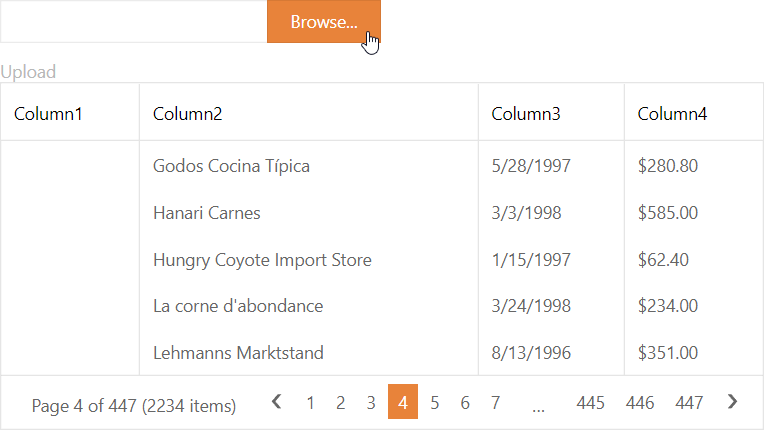

<!-- default badges list -->

[](https://supportcenter.devexpress.com/ticket/details/E5199)
[](https://docs.devexpress.com/GeneralInformation/403183)
<!-- default badges end -->
# Grid View for ASP.NET Web Forms - How to display data from an uploaded Excel file

This example demonstrates how to use the [ASPxUploadControl](https://docs.devexpress.com/AspNet/DevExpress.Web.ASPxUploadControl) to let a user upload a Microsoft Excel file to the server and view the uploaded file's data in a Grid View. 

> **Note:** The example application uses the `DevExpress.Docs` assembly. The [Document Server](https://www.devexpress.com/Products/NET/Document-Server/) subscription license is required to use the demonstrated technique.



## Implementation Details

1. Add an ASPxGridView and ASPxUploadControl to a page.

2. Handle the upload control's [ASPxUploadControl.FileUploadComplete](https://docs.devexpress.com/AspNet/DevExpress.Web.ASPxUploadControl.FileUploadComplete) event on the server and [ASPxClientUploadControl.FileUploadComplete](https://docs.devexpress.com/AspNet/js-ASPxClientUploadControl.FileUploadComplete) event on the client.

3. Use the `ASPxUploadControl.FileUploadComplete` handler to save the uploaded files to the `"~/XlsTables/"` directory. Save the file path to the session.

    ```cs
    string FilePath {
        get { return Session["FilePath"] == null ? String.Empty : Session["FilePath"].ToString(); }
        set { Session["FilePath"] = value; }
    }
    protected void Upload_FileUploadComplete(object sender, DevExpress.Web.FileUploadCompleteEventArgs e) {
        FilePath = Page.MapPath("~/XlsTables/") + e.UploadedFile.FileName;
        e.UploadedFile.SaveAs(FilePath);
    } 
    ```

4. Call the [ASPxClientGridView.PerformCallback](https://docs.devexpress.com/AspNet/js-ASPxClientGridView.PerformCallback(args)) method from the `ASPxClientUploadControl.FileUploadComplete event` handler to refresh the Grid View after a file is uploaded.

    ```js
    function OnFileUploadComplete(s, e) {
        Grid.PerformCallback();
    }
    ```

4. Handle the [ASPxGridView.Init](https://docs.microsoft.com/en-us/dotnet/api/system.web.ui.control.init?view=netframework-4.8) event. Check the `Session["FileName"]` object's value in the event handler. If the value is not `null`, use the [Spreadsheet Document API](https://docs.devexpress.com/OfficeFileAPI/14912/spreadsheet-document-api) to export the saved Excel file to a DataTable object and bind the Grid View to this object.

```cs
    protected void Grid_Init(object sender, EventArgs e) {
        if (!String.IsNullOrEmpty(FilePath)) {
            Grid.DataSource = GetTableFromExcel();
            Grid.DataBind();
        }
    }
    private DataTable GetTableFromExcel() {
        Workbook book = new Workbook();
        book.InvalidFormatException += book_InvalidFormatException;
        book.LoadDocument(FilePath);
        Worksheet sheet = book.Worksheets.ActiveWorksheet;
        CellRange range = sheet.GetUsedRange();
        DataTable table = sheet.CreateDataTable(range, false);
        DataTableExporter exporter = sheet.CreateDataTableExporter(range, table, false);
        exporter.CellValueConversionError += exporter_CellValueConversionError;
        exporter.Export();
        return table;
    }
```

## Files to Look At

- [Default.aspx](./CS/Solution/Default.aspx) (VB: [Default.aspx](./VB/Solution/Default.aspx))
- [Default.aspx.cs](./CS/Solution/Default.aspx.cs) (VB: [Default.aspx.vb](./VB/Solution/Default.aspx.vb))
- [Error.aspx](./CS/Solution/Error.aspx) (VB: [Error.aspx](./VB/Solution/Error.aspx))
- [Error.aspx.cs](./CS/Solution/Error.aspx.cs) (VB: [Error.aspx.vb](./VB/Solution/Error.aspx.vb))

## Documentation

- [Office File API](https://docs.devexpress.com/OfficeFileAPI/14911/office-file-api)
- [File Upload](https://docs.devexpress.com/AspNet/8298/components/file-management/file-upload)

## More Examples

- [Grid View for ASP.NET MVC - How to display data from an uploaded Excel file](https://www.devexpress.com/Support/Center/p/T576892)
- [Grid View for Web Forms - How to upload files in Edit mode and see them on a click in Browse mode](https://github.com/DevExpress-Examples/aspxgridview-upload-files)
